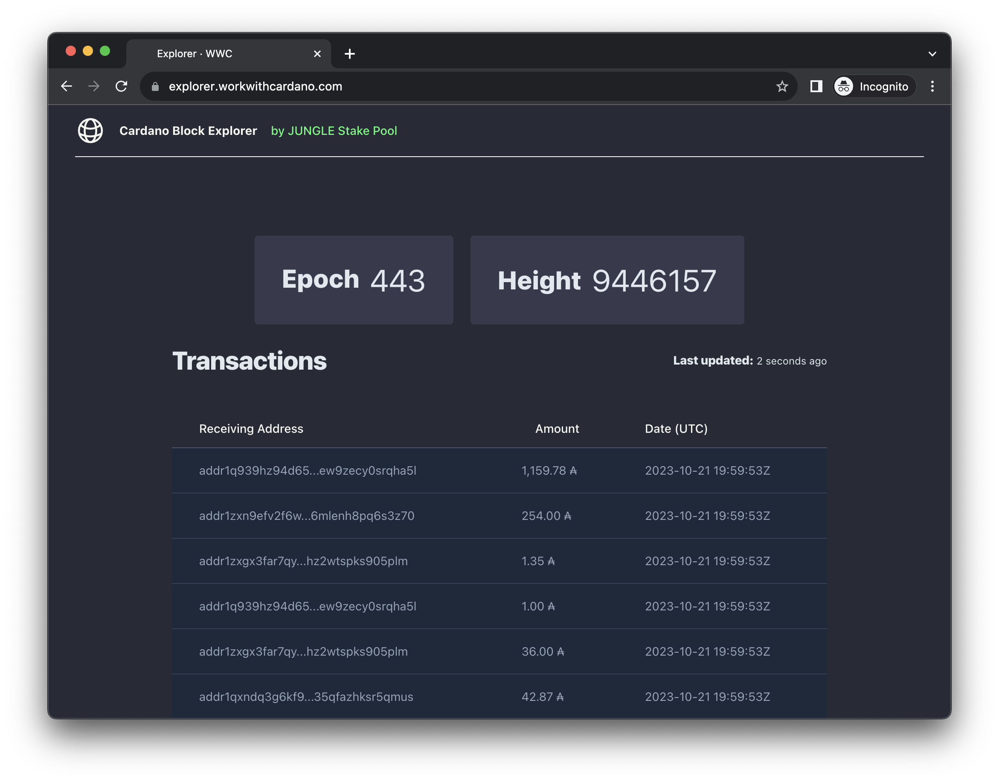

# Watcher

A Dashboard for monitoring Cardano addresses. Reads chain data from a Redis stream populated by [Oura](https://github.com/txpipe/oura).

## Running

* Install compiler dependencies with `asdf install`
* Run `mix setup` to install and setup dependencies.
* See `.env.sample` as reference for required ENVs.
* Start the app with `iex -S mix`

For the time being, it simply logs when a given address receives any ADA.

