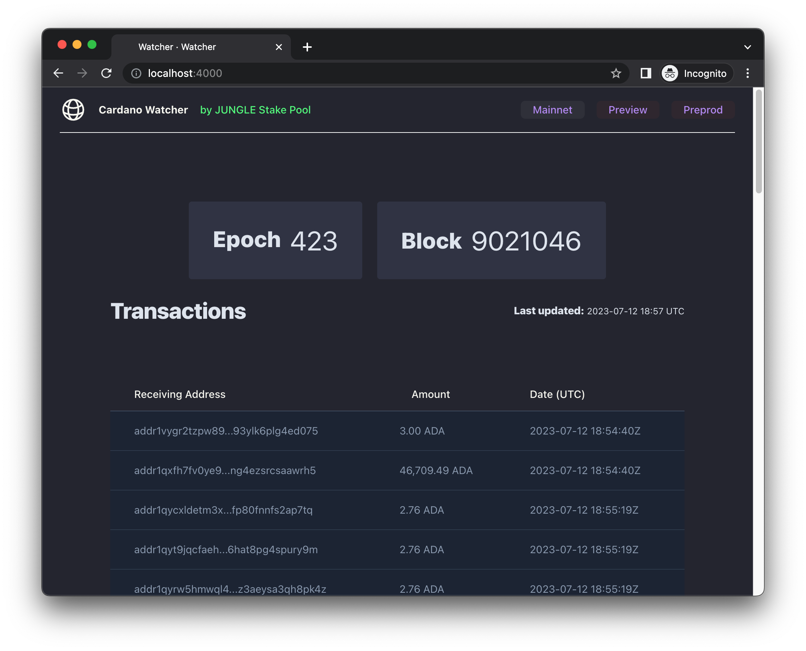
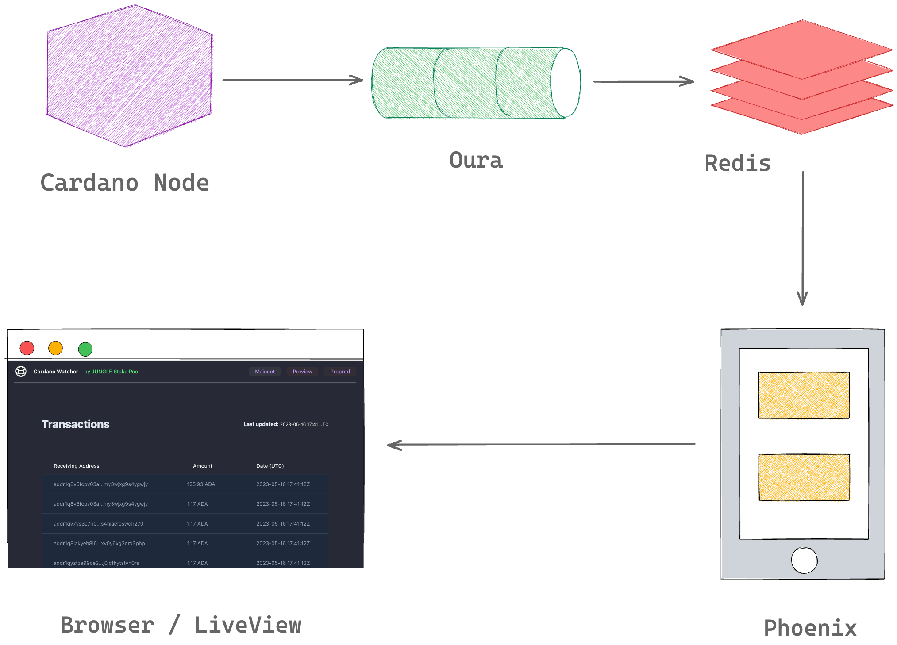

# Watcher

A Dashboard for monitoring Cardano addresses. Reads chain data from a Redis stream populated by [Oura](https://github.com/txpipe/oura).

## Running

* Install compiler dependencies with `asdf install`
* Run `mix setup` to install and setup dependencies.
* See `.env.sample` as reference for required ENVs.
* Start the app with `iex -S mix`

For the time being, it simply displays addresses receiving ADA along with the amount of the transfer.

## Architecture

The architecture contains the following services:

1. Cardano Node
2. Oura
3. Redis
4. Phoenix

Chain data from a local [Cardano Node](https://github.com/input-output-hk/cardano-node) is read by [Oura](https://github.com/txpipe/oura) which has a [sink configured for Redis Streams](https://txpipe.github.io/oura/sinks/redis_streams.html). A [Phoenix server](https://www.phoenixframework.org/) subscribes to the Redis Stream and upon receiving events from the stream, it broadcasts them to [Phoenix PubSub](https://github.com/phoenixframework/phoenix_pubsub) subscribers. 

The main page for the dashboard is a LiveView which is a subscriber to PubSub. Upon receiving the broadcast, the LiveView updates the socket with new data which in turn updates the page.

## Tests

Running tests depends on Redis.  
More info TBD.
